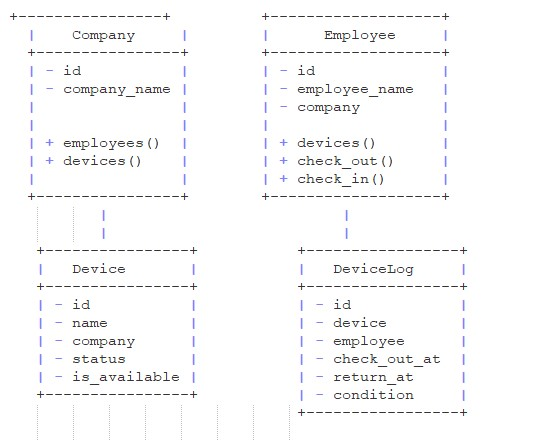

### OVERVIEW
- You have been hired as a developer for a new project where,
- You will write a Django app to track corporate assets such as phones, tablets, laptops and other gears handed out to employees.

### GOALS
- The application might be used by several companies
- Each company might add all or some of its employees
- Each company and its staff might delegate one or more devices to employees for a certain period of time
- Each company should be able to see when a Device was checked out and returned
- Each device should have a log of what condition it was handed out and returned

### DESIGN
A class rough diagram of the implementation:

